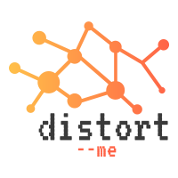

<p align="center">
    
</p>

# distort --me
> CLI utility for augmentation and preprocessing images.
>
---
## Table of Contents
- [Installation](#installation)
- [Installation from source](#installation-from-source)
- [Features and commands ](#features-and-commands)
- [Usage](#usage)
- [License](#license)

---
## Installation
```shell
$ pip install distortme
```

## Installation from source
> Install <a href=https://github.com/python-poetry/poetry>poetry</a> to build package
```shell 
$ pip install poetry
``` 

### Clone

> Clone repo to your local machine
```shell 
$ git clone https://github.com/rahowa/distortme.git
```

### Setup

> Now install package to local enviroment with poetry

```shell
$ cd distortme
$ poetry install
```
> Check installation 

```shell
$ distortme --help
```

---
## Features and commands 

**Commands**:
- `distortme info` Get info about certain dataset
- `distortme unpack` Unpack any archive with one command 
- `distortme show` Show image inside terminal for fast checking 
- `distortme augs` Perform augmentations for images before training 
- `distortme voc2coco` Convert PASCAL VOC dataset format to COCO format 
- `distortme coco2voc` Convert COCO dataset format to PASCAL VOC format 
- `distortme split` Sort by folders images with certain descriptor in name 
- `distortme map` Apply custom dataset preprosesing with multiple prosesses 
- `distortme torle` `distortme fromrle` Convert segmentation masks to RLE-encoding and back 
- `distortme tohd5` `distortme fromhd5` Compress dataset to HDF5 format and decompress back 
- `distortme download` Allows to download most popular datasets to given folder without any code 
- `distortme label` Create labels for `Face detection`, `Object detection` [IN PROGRESS] and `Classification` [IN PROGRESS] tasks for your custom dataset 

**Options**:
* `--install-completion`: Install completion for the current shell.
* `--show-completion`: Show completion for the current shell, to copy it or customize the installation.
* `--help`: Show this message and exit.


## Documentation
For more information check [DOCS.md](DOCS.md) file

## Usage
**Use `distortme` as a regular CLI app**:

```console
$ distortme [OPTIONS] COMMAND [ARGS]...
```

---
## Created with
<a href="https://github.com/albumentations-team/albumentations" target="_blank"></a>
<a href="https://typer.tiangolo.com/"></a>
<a href="https://python-poetry.org/"></a>

## License

[](http://badges.mit-license.org)

**[MIT license](http://opensource.org/licenses/mit-license.php)**
